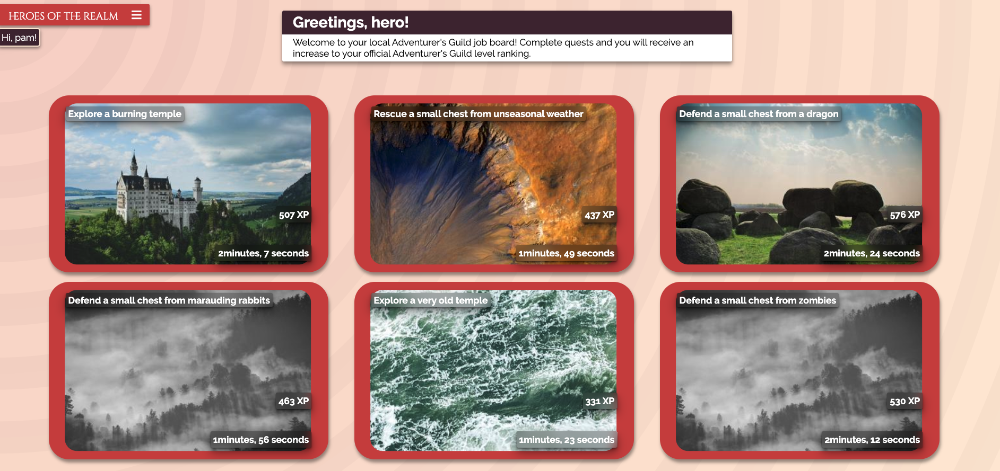

# **HEROES OF THE REALM**

**[ Web app can be accessed at: https://heroes-of-the-realm.azurewebsites.net](https://heroes-of-the-realm.azurewebsites.net)**

## A Jobs board for Adventurers in a fantasy land...



This is the source code for the front-end portion of my portfolio project; Heroes Of the Realm. This site is a modern re-imagining of an fantasy-world Adventurers Guild; where heroes may hear about quests that they can go on. Heroes can select a quest from the board, and after waiting for the quest to be completed, 'experience points' will be provided to you, thus increasing your Adventure Rank.

The front-end is **REACT.js**, deployed through the backend's Kestrel web server. MobX is used for state management, including the storage of JWT session keys. CSS is managed through Styled Components.

The back-end is a **C# .NET Core** server, with a **SQL Server** database. The source code for the back-end can be viewed at [https://github.com/stuart-p/heroes-of-the-realm-server](https://github.com/stuart-p/heroes-of-the-realm-server). The API can be interrogated direction using the following enpoint: [https://heroes-of-the-realm.azurewebsites.net/api](https://heroes-of-the-realm.azurewebsites.net/api)

## Getting Started (usage)

The website can be accessed using a web browser to visit the site [here](https://heroes-of-the-realm.azurewebsites.net). It has been optimised for mobile usage, but can be viewed on desktop also.

### Pages and Functions

A Login/register element is displayed if the user is not currently logged in. Once logged in this will be replaced by the nav bar.

A drop-down header bar is present on all pages, and can be used for core navigation of the site. Pressing the bar displays the nav menu, which includes a link to the landing page, edit profile, adventure ranking, quests and logout.

The main landing page displays a brief introduction to the site, and links to the Github repositories. It can be navigated to via the 'home' button on the header bar.

The 'edit profile' page can be used to modify your adventurer profile on the site. Name, type of adventurer, and profile picture can all be changed and saved.

The 'Adventurer ranking' page can be used to view list of all registered users of the site. Results are ordered according to adventuring experience level. Selecting an adventurer's card will bring up more detailed information for that particular adventurer, including a list of all their completed quests.

The 'Quests' page can be used to view all the currently-active quests on the jobs board. Selecting a quest card brings up additional information about the quest, and allows the user to 'begin' the quest if they choose. Once a quest is begun, it will countdown to its completion time, upon which experience will be awarded to your profile. Only one quest can be undertaken at once.

## Getting Started (development)

If you would like your own example of this front end up and running, you can use these instructions to start a local instance for development and testing purposes.

### Prerequisites

this project requires `NODE.js`, minimum version: V12. It has the following dependencies:

```
production:
    @reach/router: ^1.3.3
    axios: ^0.19.2
    jwt-decode: ^2.2.0
    mobx: ^5.15.4
    mobx-react: ^6.1.8
    react: ^16.13.1
    react-dom: ^16.13.1
    react-scripts: ^3.4.1
    react-toastify: ^5.5.0
    react-transition-group: ^4.3.0
    styled-components: ^5.0.1
```

## Built with

This project was built with VSCode, using Javascript and the React.js front-end library. The initial project template was generated using `npx create-react-app`

## Author

This project was built by **Stuart Palmer** as a demonstration of JWT access tokens in March 2020.
